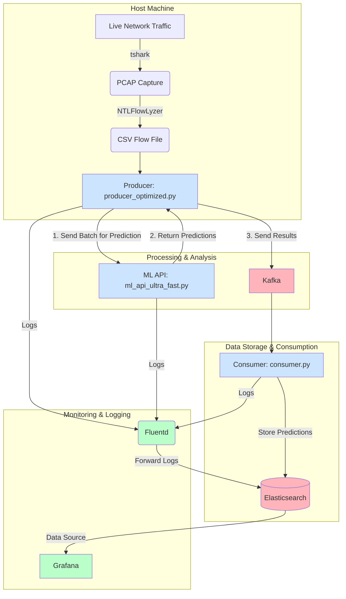

# Real-Time DDoS Attack Detection System

This project implements a real-time, high-performance system for detecting Distributed Denial of Service (DDoS) attacks on a network. It captures live network traffic, processes it into flows, uses a machine learning model to predict attacks, and provides a full pipeline for logging and monitoring the results.

## Architecture

The system is composed of several microservices and components that work together to create a robust data pipeline. The data flows through the system as follows:



## Key Features

-   **Real-Time Traffic Capture**: Uses `tshark` to capture live network packets.
-   **High-Performance Flow Analysis**: Converts raw packet captures into network flows using `NTLFlowLyzer`.
-   **Machine Learning-Based Detection**: A high-speed FastAPI server (`ml_api_ultra_fast.py`) serves a pre-trained Logistic Regression model for DDoS prediction.
-   **Asynchronous Processing**: The producer (`producer_optimized.py`) is fully asynchronous, using `aiohttp` for non-blocking requests to the ML API and `kafka-python` for sending results.
-   **Batch Processing**: Both the producer and the ML API process flows in batches for maximum throughput.
-   **Scalable Messaging**: Uses Apache Kafka as a message broker to decouple the producer and consumer.
-   **Data Storage & Indexing**: The consumer (`consumer.py`) stores prediction results in Elasticsearch for powerful querying and analysis.
-   **Centralized Logging & Monitoring**: Fluentd collects logs from all components and forwards them to Elasticsearch. A pre-configured Grafana dashboard provides real-time monitoring of the system's health and performance.
-   **Containerized Infrastructure**: All backing services (Kafka, Zookeeper, Elasticsearch, Grafana, Fluentd) are managed via Docker Compose for easy setup and teardown.

## Prerequisites

Before you begin, ensure you have the following installed on your system:

-   [**Docker**](https://www.docker.com/products/docker-desktop/) and **Docker Compose**
-   [**Python**](https://www.python.org/downloads/) (version 3.11 or higher)
-   [**Poetry**](https://python-poetry.org/docs/#installation) for Python package management.
-   [**tshark**](https://www.wireshark.org/download.html): The command-line utility for Wireshark. Make sure it is added to your system's PATH.

## Setup & Installation

1.  **Clone the repository:**
    ```bash
    git clone <repository-url>
    cd <repository-directory>
    ```

2.  **Install Python Dependencies:**
    Use Poetry to install all the required Python packages from the `pyproject.toml` file.
    ```bash
    poetry install
    ```

3.  **Start the Infrastructure Services:**
    Use Docker Compose to start all the necessary services in the background.
    ```bash
    docker-compose up -d
    ```
    This command will pull the required images and start containers for:
    - Zookeeper
    - Kafka
    - Elasticsearch
    - Grafana
    - Fluentd

## How to Run the System

The main components of the system (ML API, Consumer, and Producer) need to be run in separate terminals. Make sure you are in the project's root directory and have the Poetry environment activated.

1.  **Start the ML API:**
    Open a terminal and run the following command to start the FastAPI server.
    ```bash
    poetry run python ml_api_ultra_fast.py
    ```
    The API will be available at `http://localhost:8000`.

2.  **Start the Consumer:**
    In a second terminal, start the Kafka consumer. It will listen for processed flows and save them to Elasticsearch.
    ```bash
    poetry run python consumer.py
    ```

3.  **Start the Producer:**
    In a third terminal, start the main producer script. This will initiate the live traffic capture and the entire processing pipeline.
    ```bash
    poetry run python producer_optimized.py
    ```

## Project Components

### `producer_optimized.py`
This is the heart of the system. It orchestrates the entire pipeline:
-   Continuously captures network traffic to a `.pcap` file using `tshark`.
-   Uses the `NTLFlowLyzer` library to convert the `.pcap` file into a `.csv` file of network flows.
-   Reads the flow data and sends it in batches to the ML API for prediction.
-   Receives the predictions and sends the final, enriched data to a Kafka topic.
-   It is highly asynchronous to handle network I/O efficiently.

### `consumer.py`
A Kafka consumer that subscribes to the `processed_network_flows` topic. It receives messages from the producer and indexes them in Elasticsearch, making them available for searching and visualization.

### `ml_api_ultra_fast.py`
A high-performance FastAPI application that exposes a `/predict-batch/` endpoint. It receives a batch of network flows, preprocesses the data (handling categorical features and ensuring correct data types), and uses a loaded scikit-learn model (`LR_model_artifacts.pkl`) to return DDoS predictions.

### `docker-compose.yml`
Defines and configures all the necessary third-party services, ensuring they can communicate with each other on a shared Docker network.

## Monitoring & Visualization

The system is equipped with tools to monitor its behavior and visualize the results.

-   **Grafana:**
    -   **URL:** `http://localhost:3001`
    -   **Login:** `admin` / `admin`
    -   A pre-configured dashboard named "DDoS Monitoring" is available to visualize logs and metrics from the system components, sourced from Elasticsearch.

-   **Elasticsearch:**
    -   **URL:** `http://localhost:9200`
    -   You can directly query the `ddos_predictions` index to inspect the raw data being stored by the consumer.

-   **Fluentd Logs:**
    Fluentd aggregates logs from all Python scripts. You can view the raw log data in the `fluentd/logs/` directory on the host machine.
